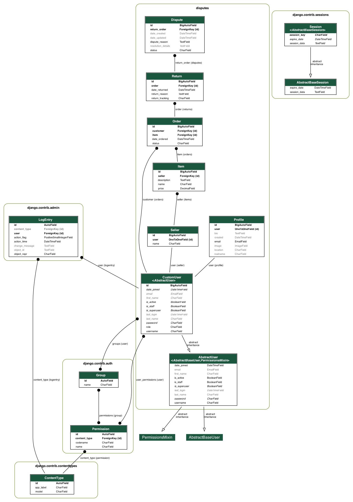

# Amazon Dispute Manager

## Setup Instructions

### Prerequisites
- Docker
- Docker Compose

### Steps

1. Clone the repository:
   ```bash
   git clone git@github.com:sksaddam007/sellcord_django.git
   cd amazon_dispute_manager
   docker-compose up --build
   curl localhost:8000
   ```
   Open the browser and hit ```localhost:8000```
### Following are the pages in the application
- Registration
   * You can register either as a customer or seller
   * Once registered it will redirect to the login page
- Login
  * If customer login it will load to orders page
  * If seller login it will load to items page
- Items
  * Once seller can add items 
  * Once item is registered it is visible to the customer
- Orders
  * Customer can select and item and order it 
  * Customer can return an item/order
- Returns
  * Seller can raise/create a dispute per return
- Disputes
  * Seller can see the disputes edit and delete

### Below is the db schema

